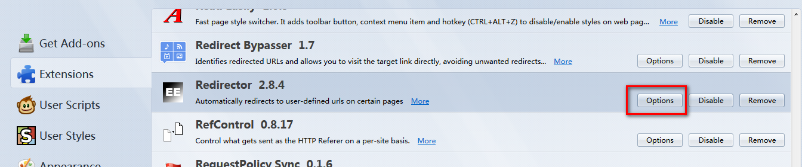
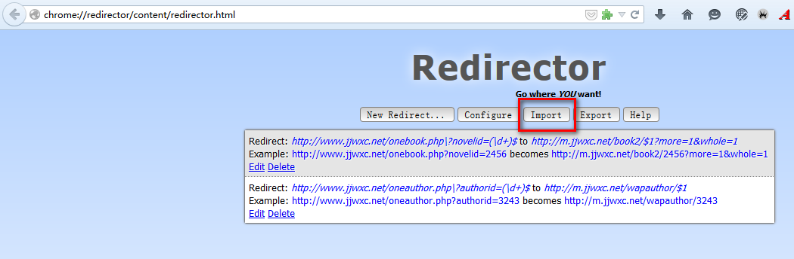

# remove_jjwxc_ad

移除晋江广告。

# firefox浏览器

使用firefox浏览器，安装扩展：[Redirector](https://addons.mozilla.org/en-US/firefox/addon/redirector/)

Redirector 支持在打开**源url**之前，将url替换成指定目标样式，然后再载入网页内容

例如，把 
**http://www.jjwxc.net/onebook.php?novelid=2456**
替换成
**http://m.jjwxc.net/book2/2456?more=1&whole=1**

# Redirector 配置

在扩展页，选中**Redirector**，点击**option**

选中**import**，导入文件：[remove_jjwxc_ad.rjson](remove_jjwxc_ad.rjson)

